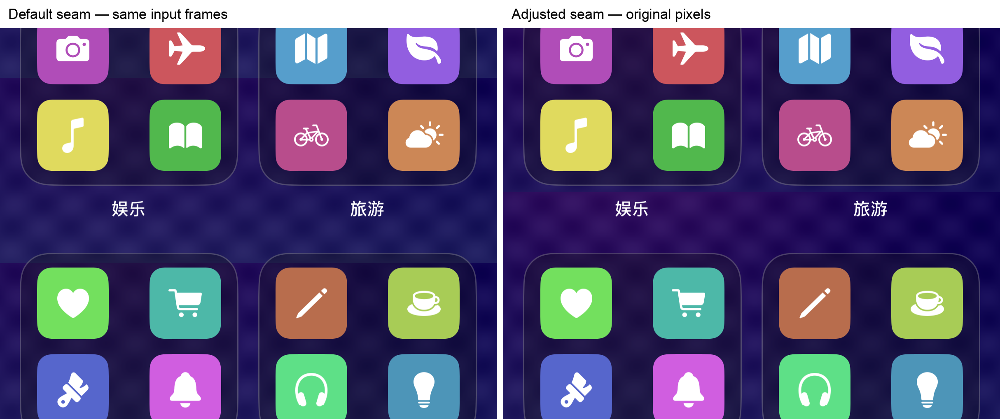

# 续页 / Longlet 0.1.5（6）半透明卡片接缝选址

日期：2026-09-15。**最终源码已通过本地验收，正在准备归档及手动分发，内部 TestFlight 可用状态尚待确认。** 版本为 0.1.5，构建 6。调查历史及完整设计见 [Beta 6 设计记录](../beta-6-app-library-seam-plan.md)。

## 用户现象与证据边界

用户反馈 0.1.4（5）的聊天上滑已正常，但系统 App 资源库的一行半透明文件夹顶部出现横向断线。原尺寸导出为 884×2380，中央背景第 847 行有明显灰度跃迁。原生截图与导出图的高相关窗口主要支持 +335 到 +337 的相近位移，另有约 0.60–0.67 的低相关窗口和错误对应，不能据此宣称全图没有丢行或重复。`387 + 460 + 1533 = 2380` 只是与一次上滑扩展相容的结构推断，没有当时原始采集帧或清单证明条带数量。

旧规则按新增行边界切割，未检查接缝是否横穿半透明卡片。固定壁纸与移动面板让同一文件夹在不同视口透出不同背景，切在卡内就会形成显眼断线。选址可以减轻这种瑕疵，但不能把固定背景变成随内容共同移动的画布。用户原图仅在本机观察，未纳入仓库或夹具。

## 最终实现与用户可见变化

**接缝尽量移到平稳空隙。** 位移被接受后，从实际保留的正文 strip 边缘读取旧像素，与 incoming 帧相同文档区间比较。可以跨多个小条带和此前裁过的条带，兼容首次事务、反转及匹配历史淘汰；最近匹配参考不能替代真实输出边缘。

评分结合像素差异、横向结构与邻行活动，避免原始 MAE 很低的不透明图标把接缝吸进卡片。最终规则保留强边缘；低对比暗玻璃则要求同一帧的一阶差和二阶差同时达标，再对两帧取 OR，避免把不同帧的坡度与噪声组合成假边缘。它不使用绝对亮度自适应，候选仍须满足平稳邻域及原收益门槛。空隙的原始 MAE 可能更高，改善指综合接缝代价，不能描述成纯像素差异必然下降。

**覆盖范围与原始首尾保持。** 新条带向旧正文内多取 s 行，就在同端移除 s 行旧正文。上限为 480 原图行、真实重叠的 35% 及安全加载范围的最小值，只读最多 486 行评分 patch。固定 caps 不借作正文，不混合或重画像素，选址不改变位移、总高度或自然顺序。完全一致、默认平稳、差异很小、无安全候选或收益不足时保持默认。

余条写成新 ID 的 immutable PNG，先写齐全部文件再原子发布清单，成功后才删除旧文件；失败保留旧清单及旧像素。用户编辑字段不承担采集裁剪，替换旧行不额外消耗屏数额度。部分接收、恰达额度、已有编辑、手动路径无完整来源或评分证据不足时保持默认。调用者持有的旧清单与磁盘较新正文／编辑冲突时直接拒绝事务，不能覆盖新结果。

**两处独立的前景匹配修复。** 验收中既有 matcher 曾将真实 102 行判断成 229 行：重复图标的真位移票数较低，被 top-8 截断。现在保留原高票邻域并补充分散峰，最多 48 个位移进入原验证，未放宽误差或歧义门槛。原重复夹具、2964 高度及完整像素期望保留，未通过换夹具掩盖问题。

另一问题发生在投票之前：完整允许范围能证明固定背景，缩窄正文 ROI 却删掉了足够的静止纹理，退回 `notLayered`。现在仅对已确认的自动 foreground 路径显式保留原静止纹理证据范围；每帧对重新证明固定层，运动特征、重叠与校验仍限正文。手动区域不扩大，不使用 sticky 放行，固定栏不成为运动证据。这两处修复独立于接缝评分。

**明细可读且可操作。** 主详情显示接缝总数、调整数和独立查看按钮，明细在可滚动页面中显示来源帧原图行、默认／实际位置、替换行数、综合接缝评分与本地化原因。保留最近 32 处，明确较早省略数量；旧记录兼容，未应用计划不记为已调整。行号不是会随 prepend 移动的最终长图坐标。

首轮 UI 中“查看接缝明细”文字实际可见，但嵌在 DisclosureGroup 内不能独立 AX 点按。摘要及至少 44 点触控区的按钮现移到 DisclosureGroup 外；中英文明细滚动、关闭及返回预览／分享已通过专门 UI 验收。

预期在有可行空隙时，文件夹和气泡内部的横线减少，背景断线留在内容之间；不能保证任意玻璃布局都有可用空隙。本轮没有实现编辑器 200 行余量或拖动接缝，也未增加自动 CI／自动发布。

## 验收口径与已知结果

原生 1179×2556 程序玻璃夹具经生产 CI、pipeline、事务和 PNG，保留原重复图标及同一输入 ON／OFF 对照。文档位置独立给出，每行必须等于选定来源帧的对应原始行，另检查覆盖、顺序、caps、配额、编辑冲突及原子回滚。

真实 UIScrollView 玻璃路线使用亮／暗两种背景、两个方向，每条同组截图分别进入 ON／OFF 生产链路。UIKit 实际布局与 contentOffset 提供独立真值。固定背景可能在多张截图同屏位置逐字节相等，来源 oracle 必须同时满足文档坐标与原像素；原 ±2 像素坐标容差及逐字节条件保留，不能先取任意像素匹配再判来源。

| 项目 | 当前可确认结果与范围 |
| --- | --- |
| 最终 Swift 核心 | 108 / 108 通过；`.work/beta6-validation/core-final-all.log` |
| 同源码确定性基准 | 217 / 217，8,776 帧通过；`.work/beta6-validation/benchmark-final/report.json` |
| 真实灰度顺序 frontier 重放 | 40 次选择：32 次实际调整均在卡片外，8 次平稳默认保持；`glass-seam-replay/sameframe-chain.log`，不是实际 iOS PNG 验收 |
| 最终原生 Release | `unit-accepted.xcresult` 92 / 92 通过，0 跳过；最后弱结构同帧条件已纳入。使用 Release 优化，仅为测试开启 `ENABLE_TESTABILITY`；分发归档不使用该覆盖 |
| 接缝详情 App UI | `seam-details-ui-retry.xcresult` 1 / 1 通过，包含中英文两个循环、32 条到底、关闭、预览／保存按钮可访问及系统分享真实打开关闭 |
| 最终玻璃真实滚动 | `glass-accepted.xcresult` 4 / 4 通过，0 跳过；48 帧、40 次拖动，四图均为 1206×7122、零拒绝。40 处接缝中默认跨卡片 30 处，实际跨卡片 0 处；32 次调整、8 次默认保留。图标像素检查分别为 80、84、80、84 项 |
| 既有真实滚动 | `old-capture-accepted.xcresult` 6 / 6 通过，0 跳过；同色固定栏三路线及固定壁纸三路线，包含两向开始与反转 |
| PNG／JPEG 保存与分享 | `save-share-accepted.xcresult` 1 / 1 通过，真实相册保存两格式并打开／关闭系统分享；使用专用模拟器的既有照片添加权限 |
| 分发 | 正在准备归档，未将上传或处理状态写成已开放测试 |

上表本地证据均在 `.work/beta6-validation/`。原图观察、原生绘制、模拟器真实手势与真机 ReplayKit 捕捉分别记录，不能互相替代。

下图取自最终暗色向下路线，同一组输入的两种输出，各裁取原分辨率 2750–3700 行，仅并排加标题。左侧接缝穿过下一组卡片顶部，右侧移到两组卡片之间；背景在空隙里的差异仍可见。图片全部由程序夹具生成，未使用用户 App 列表或私人截图。

## 性能与发布回填

接缝转换复用 `CIContext` 渲染资源并关闭 intermediate cache，不保留来源帧历史；遵循 [Apple 关于 CIContext 复用的说明](https://developer.apple.com/documentation/coreimage/cicontext)，但本轮没有证明它带来大幅提速。Release 模拟器同帧 ON 的 commit 中位约 121／133 毫秒（两方向），OFF 约 8.2 毫秒，详见 `unit-optimized-cost.json`。这是最后同帧弱条件微调前的单次对照，包含实际存储与转换成本，不能作为真机延迟、内存或温升门槛已通过的依据。

实际源代码提交、版本、归档、签名／App Group／架构审计、IPA 指纹、Apple 上传处理、中英文测试说明和原内部组可用状态，统一由主 agent 按真实执行结果补充。组内明确可用之前，不把上传或处理中称为已开放测试。

## 验证边界

- 原图局部相关与背景跃迁不证明全部采集帧、拒绝次数或完整像素无误。
- 选址本身不补未捕捉内容、不重新估计位移，也不消除固定壁纸的不连续；低收益、无平稳空隙或动态折射仍可能保留默认。
- 两处前景修复保留原匹配安全门，仍不保证任意周期内容都能定位；缺少可信重叠不能跨接。
- 固定栏沿用 0.1.4 原始首尾契约，手动与编辑语义保持。冲突清单必须拒绝，不能退化成旧数据写入。
- 最终实际路线与真机效果按后续独立结果补充；不将合成玻璃或模拟器计时代表所有系统模糊、动画和设备资源表现。
